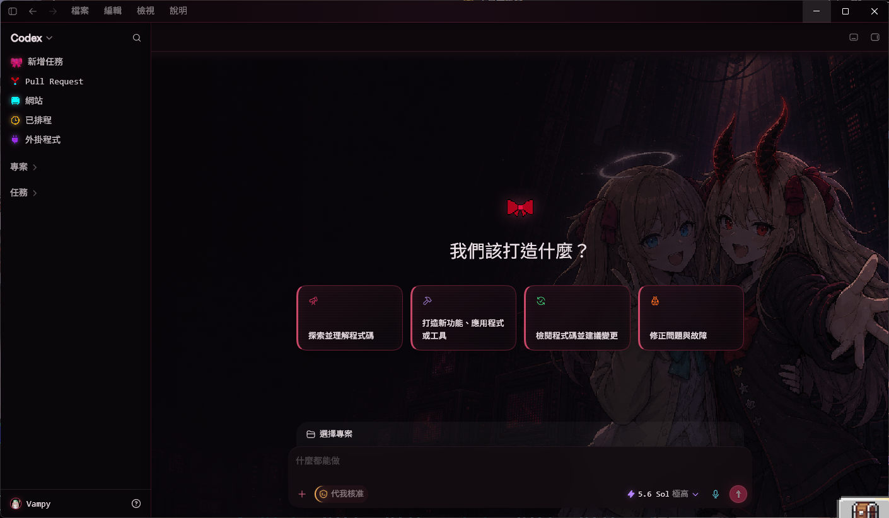
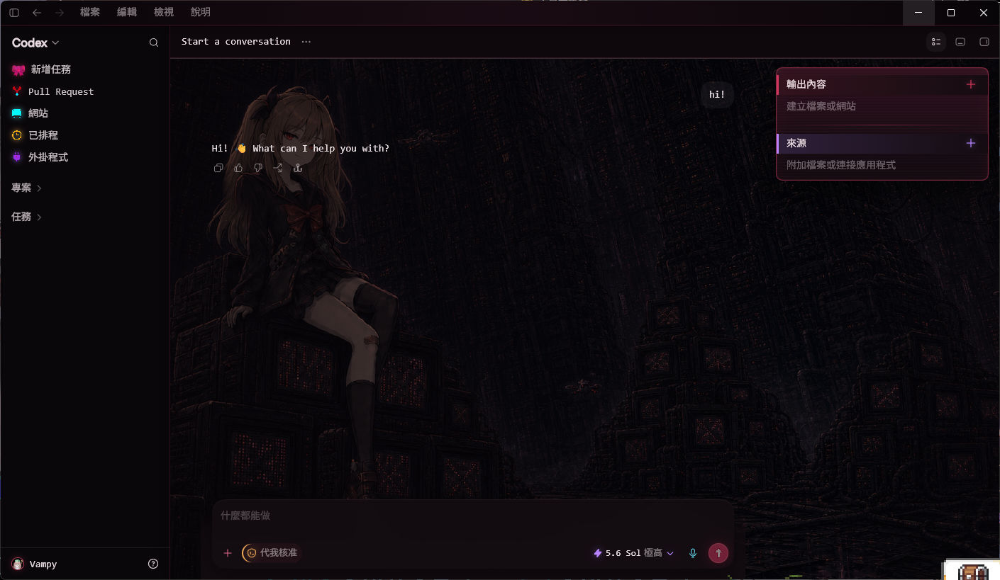
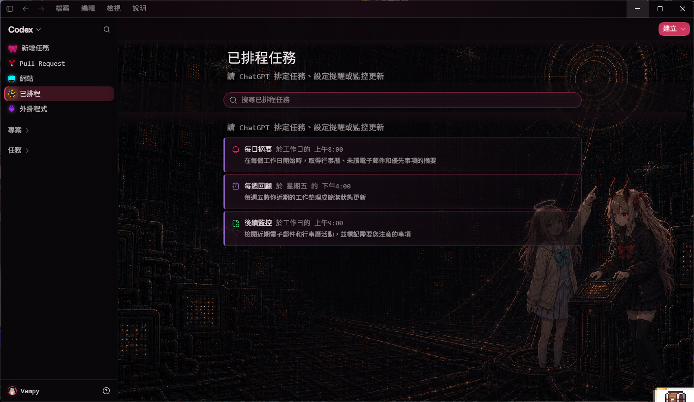

# Codex Neuro Dream Skin

<p align="center">
  <strong>中文</strong> · <a href="#english">English</a>
</p>

Windows 版 Codex 桌面端的非官方 Neuro / Evil Neuro 深色像素主題。它使用本機回環 CDP 注入樣式，不修改官方 Codex 安裝包、`app.asar` 或 WindowsApps 內容。

本專案基於 [Fei-Away/Codex-Dream-Skin](https://github.com/Fei-Away/Codex-Dream-Skin) 修改。

<p align="center">
  
</p>

## 效果展示 / Showcase

<p align="center">
  <br>
  <sub>新任务主页 / New Task home</sub>
</p>

<p align="center">
  <br>
  <sub>任务会话 / Task conversation</sub>
</p>

<p align="center">
  <br>
  <sub>已排程任务 / Scheduled tasks</sub>
</p>

## 特色

- 首頁、任務、Pull Requests、網站、排程與外掛頁面各有獨立背景
- Evil Neuro / Neuro 像素插畫、CRT 面板與高辨識度主題圖示
- 保留原生 Codex 控件與互動
- 可重複套用，也可一鍵還原

## 需求

- Windows 10 或 11
- Microsoft Store 安裝的官方 Codex 桌面端
- Node.js 22 或更新版本
- Windows PowerShell 5.1 或更新版本

## 安裝

先完全關閉 Codex，再於專案根目錄執行：

```powershell
powershell -NoProfile -ExecutionPolicy Bypass -File ".\windows\scripts\install-dream-skin.ps1"
```

安裝完成後，雙擊桌面的 `Codex Dream Skin` 捷徑。也可以直接執行：

```powershell
powershell -NoProfile -ExecutionPolicy Bypass -File ".\windows\scripts\start-dream-skin.ps1" -PromptRestart
```

Codex 更新後若主題消失，關閉 Codex 並重新執行安裝命令即可。

## 驗證

啟動主題後可輸出驗證截圖：

```powershell
powershell -NoProfile -ExecutionPolicy Bypass -File ".\windows\scripts\verify-dream-skin.ps1" -ScreenshotPath "$PWD\dream-skin-check.png"
```

開發者檢查：

```powershell
powershell -NoProfile -ExecutionPolicy Bypass -File ".\windows\tests\run-tests.ps1"
node --check ".\windows\scripts\injector.mjs"
node --check ".\windows\assets\renderer-inject.js"
```

## 還原

一般還原：

```powershell
powershell -NoProfile -ExecutionPolicy Bypass -File ".\windows\scripts\restore-dream-skin.ps1" -PromptRestart
```

還原安裝前的外觀設定並移除捷徑：

```powershell
powershell -NoProfile -ExecutionPolicy Bypass -File ".\windows\scripts\restore-dream-skin.ps1" -RestoreBaseTheme -Uninstall -PromptRestart
```

## 安全與權利聲明

- CDP 僅綁定 `127.0.0.1`，但同一 Windows 使用者下的其他本機程式仍可能連線；使用主題時只執行可信任軟體。
- 本專案不是 OpenAI 官方產品，也不受 OpenAI 或 Neuro-sama 團隊認可、贊助或背書。
- MIT License 僅涵蓋軟體程式碼；Neuro / Evil Neuro 角色形象與圖片不包含在 MIT 授權內，公開或商業再散布前請自行確認相關權利。

詳細聲明見 [NOTICE.md](./NOTICE.md)。

---

## English

An unofficial dark pixel-art Neuro / Evil Neuro theme for the Windows Codex desktop app. It injects styles through a loopback-only CDP session without modifying the official Codex package, `app.asar`, or WindowsApps files.

Based on [Fei-Away/Codex-Dream-Skin](https://github.com/Fei-Away/Codex-Dream-Skin).

### Features

- Separate artwork for Home, tasks, Pull Requests, Sites, Scheduled, and Plugins
- Neuro / Evil Neuro pixel art, CRT surfaces, and recognizable themed icons
- Native Codex controls remain interactive
- Re-applicable and reversible

### Requirements

- Windows 10 or 11
- Official Codex desktop app installed from Microsoft Store
- Node.js 22 or newer
- Windows PowerShell 5.1 or newer

### Install

Close Codex completely, then run this from the repository root:

```powershell
powershell -NoProfile -ExecutionPolicy Bypass -File ".\windows\scripts\install-dream-skin.ps1"
```

Launch the `Codex Dream Skin` desktop shortcut. You can also run:

```powershell
powershell -NoProfile -ExecutionPolicy Bypass -File ".\windows\scripts\start-dream-skin.ps1" -PromptRestart
```

If a Codex update removes the theme, close Codex and run the installer again.

### Verify

After launch, capture a verification screenshot:

```powershell
powershell -NoProfile -ExecutionPolicy Bypass -File ".\windows\scripts\verify-dream-skin.ps1" -ScreenshotPath "$PWD\dream-skin-check.png"
```

Developer checks:

```powershell
powershell -NoProfile -ExecutionPolicy Bypass -File ".\windows\tests\run-tests.ps1"
node --check ".\windows\scripts\injector.mjs"
node --check ".\windows\assets\renderer-inject.js"
```

### Restore

Normal restore:

```powershell
powershell -NoProfile -ExecutionPolicy Bypass -File ".\windows\scripts\restore-dream-skin.ps1" -PromptRestart
```

Restore the saved appearance settings and remove shortcuts:

```powershell
powershell -NoProfile -ExecutionPolicy Bypass -File ".\windows\scripts\restore-dream-skin.ps1" -RestoreBaseTheme -Uninstall -PromptRestart
```

### Security and rights

- CDP is bound to `127.0.0.1`, but other processes running as the same Windows user may still connect. Run only trusted local software while the theme is active.
- This is not an official OpenAI product and is not affiliated with, endorsed by, or sponsored by OpenAI or the Neuro-sama team.
- The MIT License covers software code only. Neuro / Evil Neuro character imagery and artwork are not included in the MIT grant; verify the relevant rights before public or commercial redistribution.

See [NOTICE.md](./NOTICE.md) for details.
